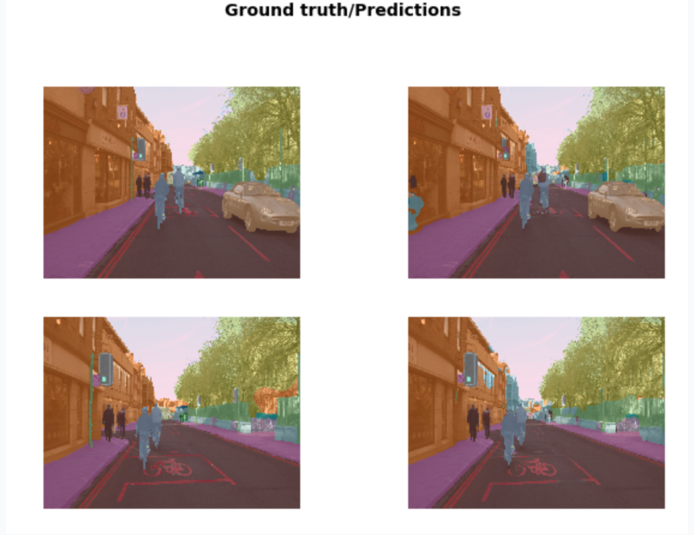

# Lesson 1

Thanks a lot to [https://blog.csdn.net/sty945/article/details/90904917](https://blog.csdn.net/sty945/article/details/90904917)

### Debug Summary

1. Pillow version not compatible when import vision

   `pip install "pillow<7"`

2. It seems like Pytorch 1.5.0 will give error, if ImageDataBunch contains get\_transforms\(\) parameter defined in the function, if remove, there will by warning saying something about deprecating stuff in pytorch 1.5.0. 

   `Expected object of scalar type Long but got scalar type Float for argument #2 'other'`

So what I did is downgrading the pytorch, and it works fine. `conda install pytorch=1.4.0 -c pytorch`

### Jupyter Tips

#### Magic line in Jupiter notebook

```python
%reload_ext autoreload #reload modules if there is any update on the package source code
%autoreload 2
%matplotlib inline #if there is any plot, plot here inside this notebook
```

#### Import \* issue

Import start is not a good choice since sometimes you don’t know what this function comes from , especially when someone else is looking at your code. But here we mainly focused on fast.ai, so it should be fine.

#### help\(function\)

Here, union means either in this brackets are accepted.

#### Build path without using os.path.join in Python3

```python
path_anno = path/'annotations'
path_img = path/'images'
print(path)
print(path_anno)
print(path_img)
```

#### Get files in current path

```python
path.ls()
```

#### Regular expression using Python re

```python
import re
temp_name = "/data/oxford-iiit-pet/images/german_shorthaired_105.jpg"
pat = r'/([^/]+)_\d+.jpg$'
pat = re.compile(pat)
print(pat.search(temp_name).group())
print(pat.search(temp_name).group(1))

/german_shorthaired_105.jpg
german_shorthaired
```

#### `doc(function_name)`

The snapshot of documentation will show up and you can redirect to full documentation.

#### `shift`+`tab`

To see the parameter infomation inside of a function.

### Batch\_size and OOM issue

* If you're using a computer with an unusually small GPU, you may get an out of memory error when running this notebook. If this happens, click `Kernel->Restart`. So try smaller batch size number when training the model. 
* And it's likely that when you change to deeper NN model, you will need to reduce to even smaller batch size since there are more parameters that needs to be updates.
* Or you can try `num_workers=0` in databunch.
* Remeber to save the trained model weight if you want to use it later for higher resolution image dataset so that you can load it before you need to restart the kernel.
* **Mixed Precision Training** means using half of the floating point to do calculationg say 32 to 16. Add `to_fp16()` to any learner.

  ```python
  learn = Learner.unet_learner(data, models.resnet34, metric = metrics).to_fp16
  ```

  Fast.ai is the first and only so far to make this work. Required newest CUDA driver. Probably, it means that when the computation is not that precise, it will probably get better on the generalization. 

### Application in Fast.ai

Four application that fast.ai supports:

* Computer vision \(vision\)
* NLP \(text\)
* Tabular data 
* Collaborative filtering

  And each application has their own designed API

### `ImageDataBunch`

Similar to `ImageDataGenerator` in Tensorflow. And there is a lot of ways to load your data intor DataBunch. 


#### With regular expression `from_name_re`

 


1. What _**size**_ of the image you want to work with? Actually is a shortcoming of a modern technology, that is, a GPU has to apply the exact same instruction through a whole bunch of things at the same in order to be fast. So generally speaking, different size and shapes are harder to deal with. We empirically crop the images to square and use the shape 224 that most of the model accepts. 
2. `ImageDataBunch.from_name_re`将返回DataBunch对象。在fastai中，所有的模型对象都是DataBunch对象，DataBunch对象包含2或3个数据集——它包含您的训练数据集、验证数据集和可选的测试数集。对于每一个数据集，它包含你的图像和标签，你的文本和标签，或者你的表格数据和标签，等等。 See below graph
3. `normalize(imagenet_stats)`  is to prepare model for transfer learning. It prepossessed image just like imageNet did, which is a required things in Transfer Learning. Some channels tend to be very bright which leads to different pixel mean value and this may introduce difficulty when do model training. 
4. Here, by default, center cropping is performed on the image in this function. \(combination of cropping and resizing, which is a way of data augmentation\)
5. DataBunch Object has a property called c: `data.c`, which indicates the number of classes you have.


#### 

### Learner

| Parameter | Definition |
| :--- | :--- |
| data | your data object from DataBatch |
| model | the model you want to fit |
| metrics | list of things that you want to printed out |

1. `cnn_leaner` is a constitutional NN learner that can handle ResNet model and so on. And of course there is much more learner classes.
2. It downloaded a pretrained model weights, which is transfer learning. So basically, you take a model that have already known something to do the things. What that means is that this particular model has actually already been trained for a particular task. And that particular task is that it was trained on looking at about one and a half million pictures of all kinds of different things, a thousand categories of things, using an image dataset called ImageNet. So we can download those pre-trained weights so that we don't start with a model that knows nothing about anything, but we actually start with a model that knows how to recognize a thousand categories of things in ImageNet.

   By doing this, you can train models in 1/100 or less of the time of regular model training with 1/100 or less of the data of regular model training.

3. The `error_rate` is the error rate for validation set by default.
4. **One cycle policy**: In short, one cycle learning is a [paper](https://medium.com/@psk.light/one-cycle-policy-cyclic-learning-rate-and-learning-rate-range-test-f90c1d4d58da) that was released in April and turned out to be dramatically better both more accurate and faster than any previous approach. 简单来说，one-cycle-policy, 使用的是一种周期性学习率，从较小的学习率开始学习，缓慢提高至较高的学习率，然后再慢慢下降，周而复始，每个周期的长度略微缩短，在训练的最后部分，学习率比之前的最小值降得更低。这不仅可以加速训练，还有助于防止模型落入损失平面的陡峭区域，使模型更倾向于寻找更平坦部分的极小值，从而缓解过拟合现象。

One-Cycle-Policy 大概有三个步骤： 1. 我们逐渐将学习率从 lr\_max / div\_factor 提高到 lr\_max，同时我们逐渐减少从 mom\_max 到 mom\_min 的动量 \(momentum\)。 2. 反向再做一次：我们逐渐将学习率从 lr\_max 降低到 lr\_max / div\_factor，同时我们逐渐增加从 mom\_min 到 mom\_max 的动量。 3. 我们进一步将学习率从 lr\_max / div\_factor 降低到 lr\_max /（div\_factor x 100），我们保持动力稳定在 mom\_max。

See more [detail](https://hacpai.com/article/1552929502787).

### Results

All the function below comes from class `ClassificationInterpretation`

#### `plot_top_losses`

Show images in top\_losses along with their prediction, actual, loss, and probability of actual class. Loss告诉你，你的预测和实际情况相比有多好。具体来说，如果你非常有信心的预测了一类狗，即你的probability特别高，你说它是哈士奇，但是实际上它是中华田园犬，你对错误的答案非常有信心，所以损失会很大，因此通过绘制最大损失，我们将绘制出对预测最自信但错误的图像。 


#### `plot_confusion_matrix`

I really like this!

#### `most_confused`

Can parse in the minimum error that you can accept and print out from high to low the pair that got wrong and the number time that the model got wrong. 


### `show_results()`

```python
learn.show_results(rows=3, figsize=(10,10))
```



### Unfreezing, fine\_tuning, and learning rates

#### `unfreeze()`

it means that you want to updating the whole model weight, instead of unfreeze a few layers. 1. unfreeze does not mean you didn't do the transfer learning, set pre\_train to False in the `cnn_learner` is equvalent to retrainning the whole model using your data. 2. So if you didn't unfreeze it, you only train the top connected layer with your own data.

See [here](https://forums.fast.ai/t/why-do-we-need-to-unfreeze-the-learner-everytime-before-retarining-even-if-learn-fit-one-cycle-works-fine-without-learn-unfreeze/41614/3) to know the good way to train mode. See [here](https://forums.fast.ai/t/lesson1-trying-to-understand-fit-one-cylcle-unfreeze-and-max-lr/27963) to know cases when different order and impact on your training. See [here](https://www.kaggle.com/danielliao/understanding-learner-freeze/comments) to actually see a experiment kernel.

#### lr\_find\(\)

This is the thing that figures out what is the fastest I can train this neural network at without making it zip off the rails and get blown apart.

* Learning rate:  how quickly am I updating the parameters in my model.

  **recorder.plot\(\)**

  Basically, plot the error rate vs. learning rate for you so that you can see what range of learning rate is appropriate if you want to retrain the model. Then,  you can go back and do below. 

  ```python
  learn.unfreeze()
  learn.fit_one_cycle(2, max_lr=slice(1e-5,1e-4))
  ```

  You use this keyword in Python called slice and that can take a start value and a stop value and basically what this says is train the very first layers at a learning rate of 1e-6, and the very last layers at a rate of 1e-4, and distribute all the other layers across that \(i.e. between those two values equally\).

#### Why the accuracy is so much worse when we retrain the whole model?

Before that, you need to have some information about layers.

**Lower layers vs higher layers**

* 更低层：更多的是基础的模式。比如第一层一般是水平线、垂线、对角线等

* 第二层是把第一层的特征结合起来，然后以此类推。

* 由于基本的模式或者几何图形大致相同，因此无需大量训练低层模型，也给模型的迁移提供了基础
* 与未训练的模型相比，unfreeze 所有层会导致准确性的丢失，因为底层的权重收到了干扰。不同的层也给出了不同的语义复杂度。因此更早的层应该以更低的学习率 fine tune 或者不训练
* 可以查看这篇[文章](https://cs.nyu.edu/~fergus/papers/zeilerECCV2014.pdf?utm_source=hacpai.com)，观察每层 cnn 获取的特征


See detail [here](https://youtu.be/BWWm4AzsdLk?t=4665). So it kind of make sense that why when we unfreeze the model, the accuracy got worse because by default, it trains all the layers at the same speed \(0.003\) which is to say it will update those things representing diagonal lines and gradients just as much as it tries to update the things that represent the exact specifics of what an eyeball looks like.

