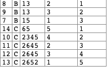

# 569. Median Employee Salary

See original page here.

## Problem

The `Employee` table holds all employees. The employee table has three columns: Employee Id, Company Name, and Salary.

```text
+-----+------------+--------+
|Id   | Company    | Salary |
+-----+------------+--------+
|1    | A          | 2341   |
|2    | A          | 341    |
|3    | A          | 15     |
|4    | A          | 15314  |
|5    | A          | 451    |
|6    | A          | 513    |
|7    | B          | 15     |
|8    | B          | 13     |
|9    | B          | 1154   |
|10   | B          | 1345   |
|11   | B          | 1221   |
|12   | B          | 234    |
|13   | C          | 2345   |
|14   | C          | 2645   |
|15   | C          | 2645   |
|16   | C          | 2652   |
|17   | C          | 65     |
+-----+------------+--------+
```

Write a SQL query to find the median salary of each company. Bonus points if you can solve it without using any built-in SQL functions.

```text
+-----+------------+--------+
|Id   | Company    | Salary |
+-----+------------+--------+
|5    | A          | 451    |
|6    | A          | 513    |
|12   | B          | 234    |
|9    | B          | 1154   |
|14   | C          | 2645   |
+-----+------------+--------+
```

## Solution

### Details

1. 不想考虑general的方法
2. 下面这个写法在leetcode中过不去的原因是ROW\_NUMBER在标号的时候，如果ORDER BY后面的变量相等，那么就回去按照默认去排下一个变量。比如下面这个，8，9，7对应的是2，3，1而不是3，2，1。



```sql
SELECT Id, Company, Salary
FROM (
    SELECT *, 
           ROW_NUMBER() OVER(PARTITION BY Company ORDER BY Salary DESC) AS desc_rn,
           ROW_NUMBER() OVER(PARTITION BY Company ORDER BY Salary ASC) AS asc_rn
    FROM Employee
    ) AS new
WHERE desc_rn IN (asc_rn - 1, asc_rn, asc_rn + 1)
ORDER BY Company, Salary;
```

### Answer



```sql
SELECT Id, Company, Salary
FROM (
    SELECT *, 
           ROW_NUMBER() OVER(PARTITION BY Company ORDER BY Salary DESC, id DESC) AS desc_rn,
           ROW_NUMBER() OVER(PARTITION BY Company ORDER BY Salary ASC, id ASC) AS asc_rn
    FROM Employee
    ) AS new
WHERE desc_rn IN (asc_rn - 1, asc_rn, asc_rn + 1)
ORDER BY Company, Salary;

```



